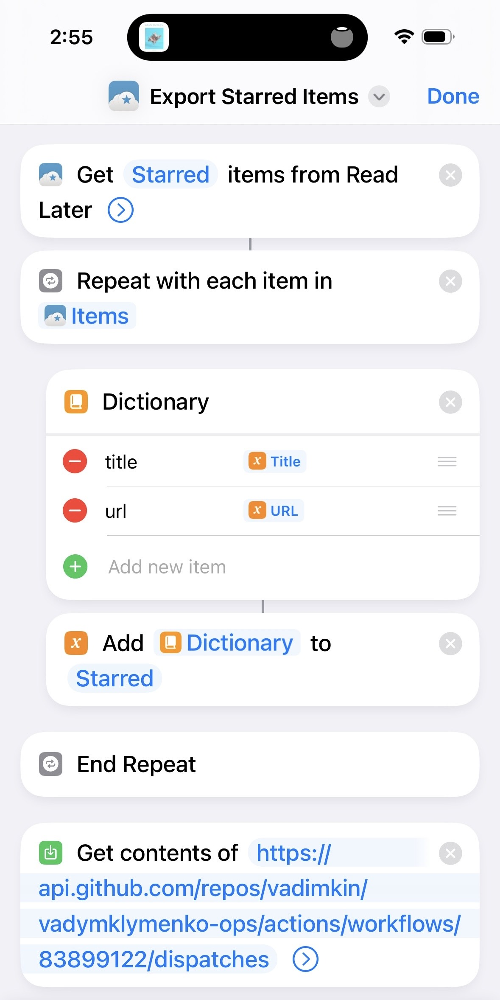

# vadymklymenko.com ops scripts

## Description

This repository contains scripts for managing some features personal.

### Reeder exporter

This is a Shortcut script (triggered automatically daily) to export all starred articles from Reeder into json.

### Goodreads parser

This is a simple parser for goodreads.com.
It parses daily my bookshelf via github actions and creates/updates `data/books.json` file with all books read.
Also, it creates/updates `data/top_rated.json` file with top rated books (4-5 stars).

This data is used to render [bookshelf](https://vadymklymenko.com/bookshelf/) on my personal website and for some other useful purposes.
